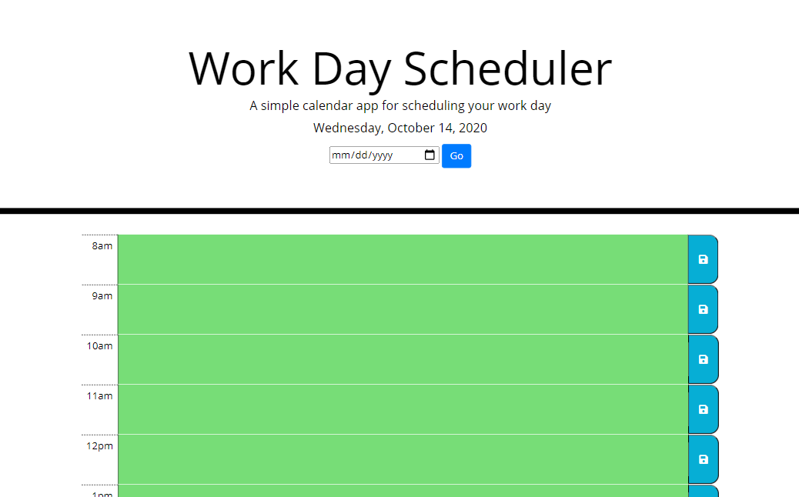

# 05_Work_Day_Scheduler

This is a web application that locally persists events into a work day scheduler.

 
 

## Internet Address

https://benjdg.github.io/05_Work_Day_Scheduler/

 
 

## Screenshot

 
 

## Usage

Record an event in on of the hour time slots and click the save button to the right of the textbox.

 
 

## Contributing

Pull requests are welcome. For major changes, please open an issue first to discuss what you would like to change.

Please make sure to update tests as appropriate.

 
 

## License
[GNU GPLv3](https://choosealicense.com/licenses/gpl-3.0/)